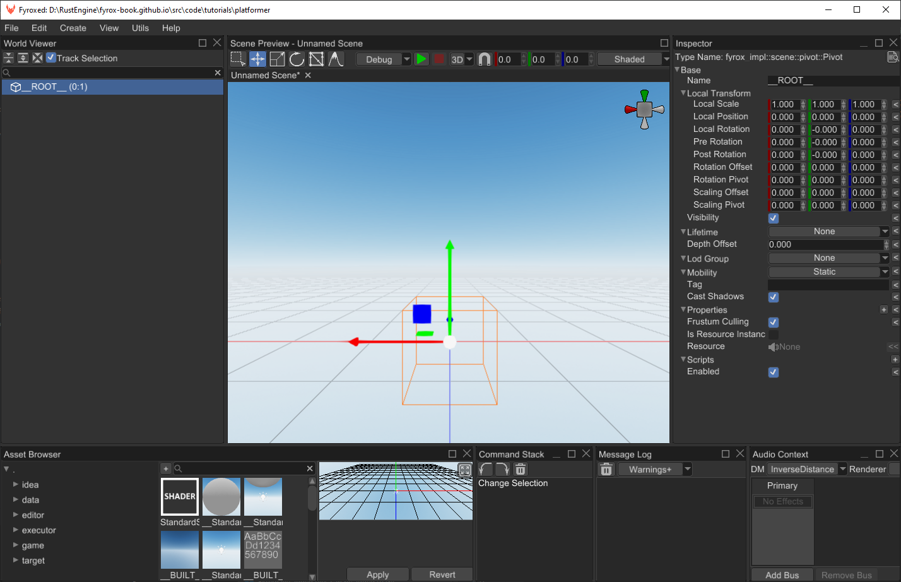
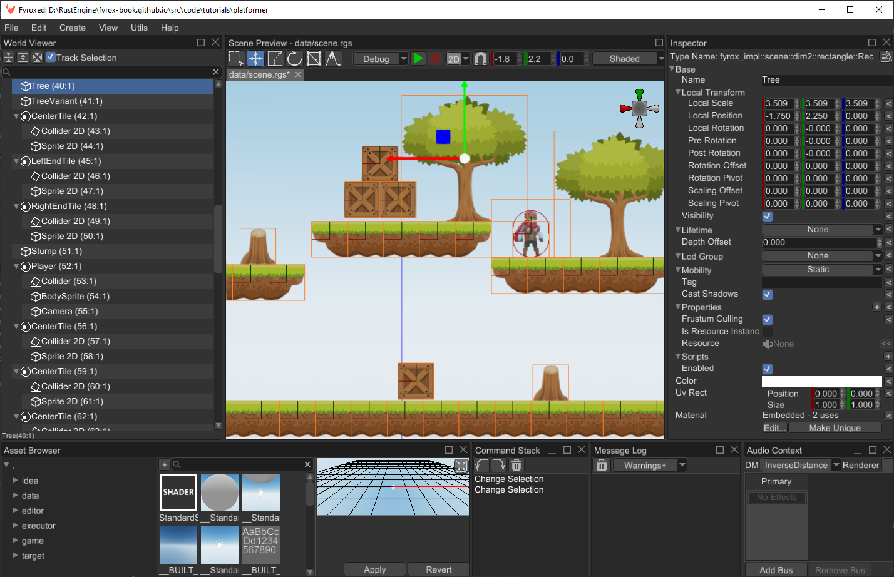
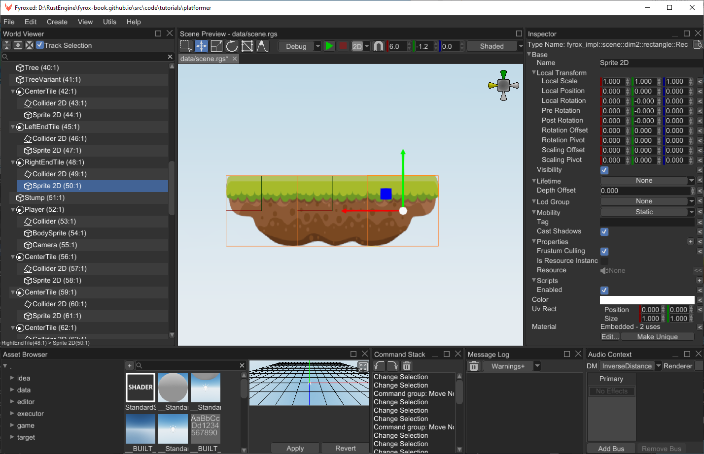
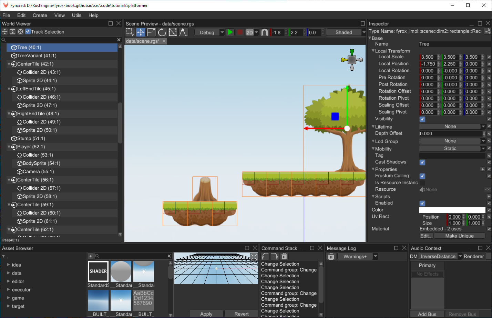
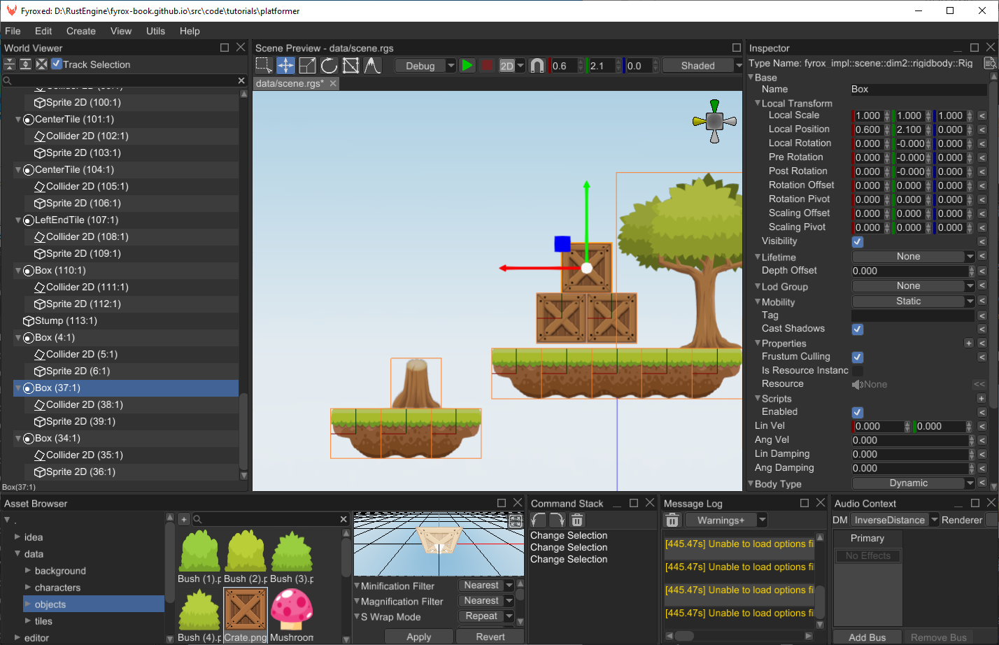
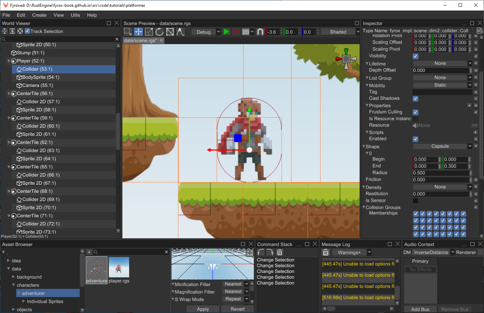
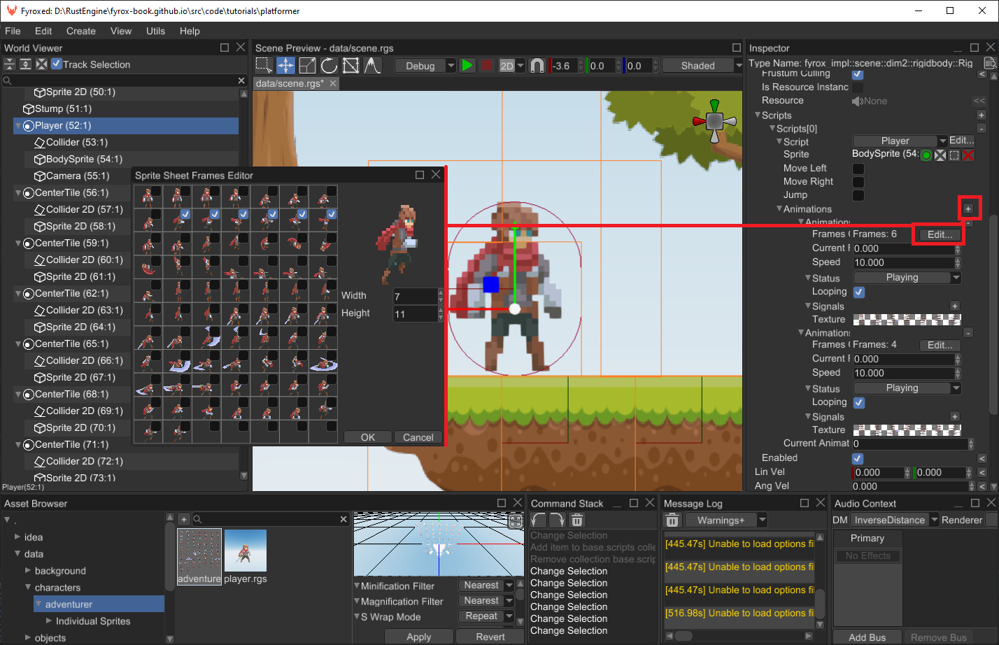

# Character Controller

## Table of Contents

- [2D Platformer Tutorial](#2d-platformer-tutorial)
  - [Table of Contents](#table-of-contents)
  - [Introduction](#introduction)
  - [Project](#project)
  - [Using the Editor](#using-the-editor)
  - [Scripts - Player](#scripts---player)
  - [Animation](#animation)
  - [Conclusion](#conclusion)

## Introduction

In this tutorial, we'll make a character controller for our 2D platformer. Here's what you'll get after finishing the tutorial:

<iframe width="560" height="315" src="https://youtube.com/embed/EcvtwEkBxNU" title="YouTube video player" frameborder="0" allow="accelerometer; autoplay; clipboard-write; encrypted-media; gyroscope; picture-in-picture" allowfullscreen></iframe>

You can find the source code of the tutorial [here](https://github.com/IThreeM/I3M-Developer-Docs.github.io/tree/main/src/code/tutorials/platformer), you can
test it yourself by cloning the repository and `cargo run --package editor --release` in the `platformer` directory.

## Project

Let's start by making a new project using the special tiny tool - `I3M-CLI` - it allows you to generate all boilerplate
parts in a single call. Install it using the following command:

```shell
cargo install I3M-CLI
```

Navigate to a folder where you want the project to be created and do the following command:

```shell
I3M-CLI init --name platformer --style 2d
```

The tool accepts two arguments - project name and a style, we're interested in 2D game so the style is set to 2D. After
the project is generated, you should memorize two commands:

- `cargo run --package editor --release` - launches the editor with your game attached, the editor allows you to run your game
inside it and edit game entities. It is intended to be used only for development.
- `cargo run --package executor --release` - creates and runs the production binary of your game that can be shipped (for
example - to a store).

Navigate to the `platformer` directory and run `cargo run --package editor --release`, after some time you should see the editor:



Great! Now we can start making our game. Go to `game/src/lib.rs` - it is where your game logic is located, as you can see
the `I3M-CLI` generate quite some code for you. There are tiny comments about which place is for what. For more info
about each method, please refer [to the docs](https://docs.rs/i3m/latest/i3m/plugin/trait.Plugin.html).

## Using the Editor

For now, we don't even need to write a single line of code, we can create a scene entirely in the editor. This section will guide
you through the process of scene creation, as a final result we'll get something similar to this:



At first, we need some assets, I prepared all required (and some more) in a separate zip archive, so you don't need to search
assets all over the internet. Download assets from [here](assets.zip) and unpack them in a `data` folder in the root folder of
your project.

Let's start filling the scene. Run the editor and remove all content from the generated scene. Since we're making a 2D game, switch the editor's
camera mode to `2D` at the top toolbar of the scene preview window. Now we need to populate the scene with some objects,
we'll start by adding a simple ground block. Right-click on `__ROOT__` of the scene in `World Viewer` and select
`Add Child -> Physics2D -> Rigid Body`. This will create a rigid body for the ground block, select the rigid body, and
set `Body Type` to `Static` in `Inspector`, by doing this we're telling the physics engine that our ground block should not move
and be rock-solid. Every rigid body requires a collider, otherwise, the physics engine will not know how to handle collisions,
right-click on the rigid body in `Inspector` and click `Add Child -> Physics2D -> Collider`. We've just added a new collider to the rigid
body, by default it has a `Cuboid` shape with a `1.0` meter in height and width. Finally, we need to add some graphics to the rigid body,
right-click on the rigid body and click `Add Child -> 2D -> Rectangle`. This adds a simple 2D sprite, select it and set a texture
to it by drag'n'dropping it from the asset browser on the white field of the `Texture` field in the `Inspector`. For my scene, I'm gonna
be using three sprites.

- `data/tiles/13.png` - left ground block
- `data/tiles/14.png` - center ground block
- `data/tiles/15.png` - right ground block

You can use any other textures and build your level as you like. After doing all these steps you should get something like this:


Clone the block by selecting its rigid body and pressing `Ctrl+C` followed by `Ctrl+V`, navigate to sprite in the copy and change its
texture to either the left or right end of the block. Use `Move Tool` to move the block somewhere you like (you can also use grid-snapping
by going to `File -> Setting` and setting `Snap To Grid` for `Move Interaction Mode`). Do this one more time for the opposite end and you
should get something like this:



Repeat these steps if you like, to add more platforms. You can also add some background objects, by creating a new sprite
(right click `__ROOT__` and click `Add Child -> 2D -> Rectangle`) and assigning a texture to it:



As the last step of world editing, let's add some dynamic objects, like boxes. Pick some random ground block, select its rigid body, and
clone it. Switch body type of the copy to `Dynamic`. Now change its sprite texture to a box (drag'n'drop `data/objects/Crate.png` to
`Texture` field) and clone the box a few times, you should get something like this:



Now for the player. As always, let's start by creating a new rigid body, adding a 2D collider to it, and setting its shape to capsule with the following
parameters - `Begin = 0.0, 0.0` and `End = 0.0, 0.3`. Add a 2D sprite (rectangle) to the rigid body and set its texture to
`data/characters/adventurer/adventurer-Sheet.png`. Set its uv rect to `(0.0, 0.0, 0.143, 0.091)` to see only one frame.
We also need a camera, otherwise, we won't see anything. Add it as a child to a player's rigid body. By default, our
camera will have no background, there'll be a black "void", this is not great and let's fix that. Select the camera
and set the `Skybox` property to `Some`. Now go to asset browser and find `data/background/BG.png`, drag'n'drop it to
the `Front` field of the `Skybox` property. Don't forget to adjust the far plane distance to something like `20.0`,
otherwise, you'll see just a portion of the background image. If everything is done correctly, you should get something like this:



Save your scene by goint to `File -> Save Scene`. Now we can run the game using the `Play/Stop` button at the top of the
scene previewer. You should see pretty much the same as in the scene preview, except
for service graphics, such as rigid body shapes, node bounds, and so on. Now we can start writing scripts.

As the last preparation step, let's import all entities at the beginning, so you don't need to find them manually, add the following code
at the beginning of the `game/src/lib.rs`:

```rust,no_run
{{#include ../../code/tutorials/platformer/game/src/lib.rs:imports}}
```

## Scripts - Player

Our scene has pretty much everything we need to start adding scripts, we'll start from the `Player` script and make our character
move. Navigate to `game/src/lib.rs` and at the end of the file add the following code snippet:

```rust,no_run
{{#include ../../code/tutorials/platformer/game/src/residuals.rs:player_stub_script}}
```

This is a typical "skeleton" of any script, for now, its methods are pretty much empty, we'll fill it with actual code very soon.
Let's go over the most important parts. The snippet starts from the `Player` structure definition which has `#[derive(Visit, Inspect, Debug, Clone, Default)]`
attributes:

- `Visit` - implements serialization/deserialization functionality, it is used by the editor to save your object to a scene file.
- `Inspect` - generates metadata for the fields of your type - in other words, it allows the editor to "see" what's inside
your structure and show additional information attached to the fields via proc-macro attributes.
- `Reflect` - implements compile-time reflection that allows the editor to mutate your objects.
- `Debug` - provides debugging functionality, it is mostly for the editor to let it print stuff into the console.
- `Clone` - makes your structure clone-able, why do we need this? We can clone objects, and we also want the script instance to be
copied.
- `Default` implementation is very important - the scripting system uses it to create your scripts in the default state.
This is necessary to set some data to it and so on. If it's a special case, you can always implement your own `Default`'s
implementation if it's necessary for your script.
- `TypeUuidProvider` is used to attach some unique id for your type, every script **must* have a unique ID, otherwise, the engine will
not be able to save and load your scripts. To generate a new UUID, use [Online UUID Generator](https://www.uuidgenerator.net/) or
any other tool that can generate UUIDs.

Finally, we implement `ScriptTrait` for the `Player`. It has a bunch of methods, their names speak for themselves. Learn more about
every method in [documentation](https://docs.rs/i3m/latest/i3m/script/trait.ScriptTrait.html)

Before we can use the script in the editor, we must tell the engine that our script exists - we must register it. Remember that
`register` method in the `PluginConstructor` trait implementation? It is exactly for script registration, replace its implementation with the following
code snippet:

```rust,no_run
{{#include ../../code/tutorials/platformer/game/src/lib.rs:register}}
```

Now the engine knows about our script and will be able to use it. It is pretty much useless in the current state, but we can already
assign it to the player. Select the player's rigid body node and find `Script` in the `Inspector`, select `Player` from the respective
drop-down list and that's pretty much it - now the script is assigned:


Let's learn how to edit script properties from the editor. In the next section, we'll be adding keyframe animation for your character,
it is a perfect opportunity to learn how the engine and the editor operate with user-defined properties in scripts. To animate the player
we need to get its sprite first. Let's start by adding the required field in the `Player` structure:

```rust,no_run,compile_fail
{{#include ../../code/tutorials/platformer/game/src/lib.rs:sprite_field}}
```

After adding this, the editor will be able to see the field and give you the ability to edit it in the Inspector.
To assign the correct handle of the sprite to the respective field in script properties, hold `Alt` and start dragging
the sprite node from the world viewer to the respective field in the player script. Release the mouse button and if
everything is ok, the field should "say" something different than "Unassigned".

Alright, at this point we know how to work with script properties, now we can start adding basic movement for the player.
Go to the `Player` structure and add the following fields:

```rust,no_run
{{#include ../../code/tutorials/platformer/game/src/lib.rs:movement_fields}}
```

These fields will store the state of keyboard keys responsible for player movement. Now for `on_os_event`, add the following code there:

```rust,no_run
{{#include ../../code/tutorials/platformer/game/src/lib.rs:on_os_event}}
```

The code responds to OS events and modifies internal movement flags accordingly. Now we need to use the flags somehow, it's time for
`on_update`. The method is called each frame and allows you to put game logic there:

```rust,no_run
{{#include ../../code/tutorials/platformer/game/src/lib.rs:on_update_begin}}
{{#include ../../code/tutorials/platformer/game/src/lib.rs:on_update_closing_bracket_2}}
{{#include ../../code/tutorials/platformer/game/src/lib.rs:on_update_closing_bracket_1}}
```

Finally, some interesting code. At first, we check if the node to which the script is assigned is a 2d rigid body, next
we're checking movement flags and form horizontal speed, and applying velocity to the body. Velocity is applied in two ways: if
the jump button was pressed - apply horizontal velocity and some vertical velocity for jumping. If the jump button wasn't pressed -
just change horizontal velocity - this will allow the player to free fall.

Run the editor and enter play mode, press `[A][D][Space]` buttons to check if everything works correctly - the player should move
horizontally and be able to jump. You can jump to the boxes on the right and push them off the ledge.

The movement is working, but the player does not change orientation, if we'll go to the left - it looks ok (despite the lack of animation),
but if we'll move to the right - it looks like the player moves backward. Let's fix that by changing the horizontal scaling of the player's
sprite. Add the following code at the end of the `if let ...` block of the code above:

```rust,no_run
{{#include ../../code/tutorials/platformer/game/src/lib.rs:sprite_scaling}}
```

The comments should clarify what's going on here, but in short, we're changing the horizontal scaling of the player's sprite if the player is
moving. The line `current_scale.x.copysign(-x_speed)` could be confusing, what it does? It replaces the sign of current horizontal scaling
using the opposite sign of `x_speed`.

Now if you run the game, the player will "look" in correct direction depending on the velocity vector.

## Animation

Since we're making a 2D game, we'll be using simple animations based on the continuous change of keyframes. In other words, we'll be changing
the texture of the player's body sprite. Luckily for us, the engine has built-in sprite sheet animations. Just add the
following fields to the `Player`:

```rust,no_run
{{#include ../../code/tutorials/platformer/game/src/lib.rs:animation_fields}}
```

Currently, we just pass default values.

```rust,no_run
{{#include ../../code/tutorials/platformer/game/src/lib.rs:animation_fields_defaults_begin}}
{{#include ../../code/tutorials/platformer/game/src/lib.rs:animation_fields_defaults_end}}
```

The Player will use multiple animations in future tutorials, but for now, it will use only two - idle and run.
Now we need to somehow switch animations. Go to `on_update` in `Player` and add the following lines after
the `x_speed` declaration:

```rust,no_run
{{#include ../../code/tutorials/platformer/game/src/lib.rs:animation_selection}}
```

Here we assume that the run animation will be at index `1` and the idle animation at index `0`. We also need to
apply the texture from the current animation to the player's sprite, and add the following lines at the end of `on_update`

```rust,no_run
{{#include ../../code/tutorials/platformer/game/src/lib.rs:applying_animation}}
```

The code is pretty straightforward - we start by trying to get a reference to the current animation by its index,
and if we're succeeded, we update it. At the next step, we're getting sprite and assigning a current frame of
the current animation.

Now we need to go to the editor again and add the animations to the `Player`, select the player's rigid body, and
find the `Script` section in the `Inspector`. Add two animations there like so:



After filling in the animations and turning them on, you can run the game and your character should play animations
correctly.

## Conclusion

In this tutorial, we've learned the basics of the new scripting system of the engine. The game we've built it very
simple, but it is just the beginning. It is easy to add more scripts for enemies, weapons, collectible items, and so on.
